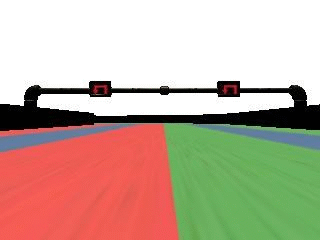

# Traffic Sign Detection
A traffic sign detection implementation based on You only look once (YOLO) v3 real-time object detection. See: https://pjreddie.com/media/files/papers/YOLOv3.pdf



## Pre-requirement
Tested on CentOS 7 with Anaconda 5.2.0 (Python 3.6), with following additional components installed:
* protobuf >= 3.5.2
* libprotobuf >= 3.5.2
* tensorflow >= 1.9.0
* keras >= 2.2.2
* hdf5 >= 1.10.2
* pillow >= 5.1.0
* eventlet >= 0.23.0
* python-socketio >= 1.9.0

To simplified the environment installation, please execute following commands directly after one have the correct Anaconda 5.2.0 installation:
* Install Tensorflow, Keras, Pillow, Eventlet, SocketIO and ProtoBuf:
    ```
    conda install -c conda-forge libprotobuf protobuf tensorflow keras hdf5  pillow Eventlet python-socketio
    ```
* Install OpenCV:
    ```
    pip install pip install opencv-python
    ```

**Notice:**
The Python 3 is required due to the minimum requirement of `keras-yolo3`. Please use the `sample_bot_py3.py` in the repository.

## Usage
1. Make sure your folder structure are placed as following:
    ```
    |-- model
    |   |-- tiny_yolo_anchors.txt
    |   |-- tiny_yolo_tf.h5
    |   `-- traffic_sign_classes.txt
    |-- yolo3
    |   |-- __init__.py
    |   |-- model.py
    |   `-- util.py
    |-- yoloSignDetection.py
    `-- sample_bot_py3.py
    ```
    For the pre-trained model, download [here](https://www.tbox.trend.com.tw/app#folder/LjjSR/TMAICarQTeam/traffic-sign-yolo3_model_20180907.tar.gz?a=o87gelhhYTM). (Password: **P@ssw0rd**)
2. Initialize the traffic sign detector in the `__init__` function of the class `AutoDrive`:
    ```python
    def __init__(self, car, record_folder = None):
        ...
        self._traffic_sign_detect = YOLOSignDetection()
    ```
3. In the `on_dashboard` function of the class `AutoDrive`, invoke traffic sign detection as following:
    ```python
    def on_dashboard(self, src_img, last_steering_angle, speed, throttle, info):
        ...
        out_boxes, out_scores, out_classes = self._traffic_sign_detect.detect_image(src_img)
    ```
4. The return result can be interpreted as following:
    * `out_boxes`: Array of bounding boxes which indicate the detected traffic signs
    * `out_scores`: Array of scores which indicate the possibility that detected traffic sign belongs to the particular class
    * `out_classes`: Array of classes which indicate the class name of the detected traffic sign

### Sample code
```python
def on_dashboard(self, src_img, last_steering_angle, speed, throttle, info):

    ...
    out_boxes, out_scores, out_classes = self._traffic_sign_detect.detect_image(src_img)
    ...
    
    if self.debug and len(out_boxes) > 0:
        print('Found %d traffic sign' % len(out_boxes))
        for i, c in reversed(list(enumerate(out_classes))):
            predicted_class = self._traffic_sign_detect.class_names[c]
            box = out_boxes[i]
            score = out_scores[i]

            top     = int(max(0, round(box[0])))
            left    = int(max(0, round(box[1])))
            bottom  = int(min(src_img.shape[0]-1, round(box[2])))
            right   = int(min(src_img.shape[1]-1, round(box[3])))

            print("%s detected score %.2f => Position (Left, Top, Right, Bottom) = (%d, %d, %d, %d)" % (predicted_class, score, left, top, right, bottom))

            cv2.rectangle(src_img, (left, top), (right, bottom), (0, 255, 0), 3)
            cv2.putText(src_img, "%s %.2f" % (predicted_class, score), (left, bottom+16), cv2.FONT_HERSHEY_PLAIN, 0.8, (0, 255, 0), 1)
```

## Reference
[1] Joseph Redmon, Ali Farhadi, "YOLOv3: An Incremental Improvement", 	arXiv:1804.02767 [cs.CV] https://arxiv.org/abs/1804.02767

[2] You only look once (YOLO) v3: https://pjreddie.com/darknet/yolo/

[3] Keras-Yolo3 Implementation Github: https://github.com/qqwweee/keras-yolo3
